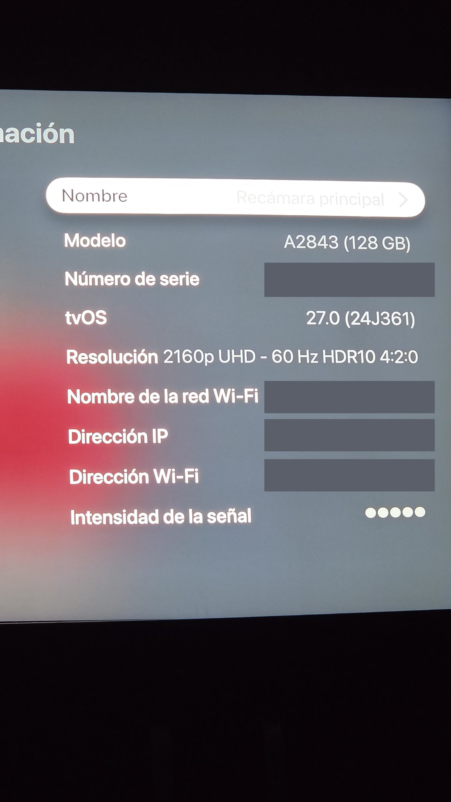

# Hi-Res Lossless の検証：Apple TV + HDMI オーディオ分離器 + 複数の DAC

> 🌐 [Español](README.md) · [English](README.en.md) · [中文](README.zh.md) · [हिन्दी](README.hi.md) · **日本語** · [Português](README.pt.md)

Apple TV（tvOS 27）が、Apple Music で「ハイレゾロスレス（Hi-Res Lossless）」と表示されたコンテンツについて、実際に 48kHz を超える音声を出力していることを確認した実地テストの記録です。同じ HDMI オーディオ分離チェーンに接続した異なる DAC で検証しました。

## 共通の構成

- **ソース**：Apple TV 4K（第 3 世代、2022 年モデル）、モデル A2843（128 GB）、tvOS 27.0（24J361）、Apple Music アプリ
- **接続**：HDMI（Apple TV）→ HDMI オーディオ分離器 → 光／同軸出力 → テスト対象 DAC の入力
- **HDMI 分離器**：汎用の「HDMI/MHL to IIS I2S」オーディオ分離器（I2S/DSD、光、同軸出力、ケース付き）（[AliExpress](https://www.aliexpress.com/item/1005009869837996.html)）

使用した Apple TV の「設定 → 一般 → 情報」画面：モデル **A2843（128 GB）**、**tvOS 27.0（24J361）**。シリアル番号とネットワーク情報は隠しています。

---

## DAC 1：FiiO K7

**検証機器**：FiiO K7（DAC／アンプ）、ボリュームノブ周囲の RGB LED インジケーター

### テスト方法

FiiO K7 には数値表示のディスプレイがありません。FiiO の公式サポートページによると、入力デジタル信号のサンプルレートを RGB LED の色で表示します：

| LED の色 | 意味 |
|---|---|
| シアン | サンプルレート ≤ 48kHz |
| 黄色 | サンプルレート > 48kHz |
| 緑 | DSD 信号 |

### 観察結果

- Apple Music で **「Hi-Res Lossless」** と表示された曲（Coldplay —「Green Eyes」）を再生 → LED が **黄色** に（> 48kHz）
- 通常の **「Lossless」** と表示された曲（Miley Cyrus —「Younger Now」）を再生 → LED が **シアン／青** に（≤ 48kHz）

### 写真による証拠 — FiiO K7

**Hi-Res Lossless の曲（Coldplay —「Green Eyes」、*A Rush of Blood to the Head*）**

Apple TV の Apple Music 画面左下に「Hi-Res Lossless」バッジが表示されています。

K7 の LED が **黄色／緑** に点灯 — FiiO 公式の表のとおり、サンプルレートが 48kHz を超えていることを示しています。

**通常の Lossless の曲（Miley Cyrus —「Younger Now」）**

ここではバッジに「Lossless」とだけ表示されています（「Hi-Res」なし）。

K7 の LED が **シアン／青** に変化 — サンプルレートが 48kHz 以下であることを示しており、この曲の通常（非ハイレゾ）の分類と一致します。

**チェーン内の HDMI オーディオ分離器**

Apple TV と DAC の間に接続された分離器の出力パネル（光、同軸、IIS/I2S）のクローズアップ。ステータス LED が緑色に点灯し、信号が有効であることを示しています。

**動画**：LED がリアルタイムで色を変える様子。

https://github.com/user-attachments/assets/fa6dc061-688a-4db3-85d3-997c63ec1e9c

[オリジナル画質（.mov）](https://github.com/poch312/Oscar/releases/download/videos-hires/k7-led-cambio-color-video.mov)

---

## DAC 2：Fosi Audio ZD3

**検証機器**：Fosi Audio ZD3、円形 OLED ディスプレイ — K7 と異なり、おおよその色ではなくサンプルレートの **正確な数値** を表示します。

### 観察結果

Apple Music で **Hi-Res Lossless** と表示された **「Green Eyes」**（Coldplay — *A Rush of Blood to the Head*）を **光（OPT）** 入力で再生：

- ZD3 の画面表示：**192k**（サンプルレート）、**PCM**（フォーマット）、ボリューム **50**
- 色による近似ではなく正確な数値で、信号が 24-bit/192kHz で届いていることを確認。tvOS 27 以前に存在した 48kHz の上限を大きく上回っています

これは K7 よりも **精密な** 確認です：K7 は黄色で「48kHz 超」を示すだけですが、ZD3 は正確な値（192kHz）を確認できます。

### 写真による証拠 — Fosi ZD3

Hi-Res Lossless の曲を再生中、ZD3 の画面に **192k / OPT / PCM**、ボリューム 50 と表示されています。

Apple TV で Coldplay の「Green Eyes」（アルバム *A Rush of Blood to the Head*）を再生中。「Hi-Res Lossless」バッジが表示され、右下のサウンドバーの上に HDMI オーディオ分離器が見えます。

**動画**：

*動画 1*

https://github.com/user-attachments/assets/82a875ff-21fc-429f-bb8d-3ef2c630162e

[オリジナル画質（.mov）](https://github.com/poch312/Oscar/releases/download/videos-hires/zd3-video-1.mov)

*動画 2*

https://github.com/user-attachments/assets/a61e8090-e8d0-4bf9-a687-05de88ff00e6

[オリジナル画質（.mov）](https://github.com/poch312/Oscar/releases/download/videos-hires/zd3-video-2.mov)

*動画 3*

https://github.com/user-attachments/assets/0e932fb8-033e-4ee8-ab29-6125ce7eeeb3

[オリジナル画質（.mov）](https://github.com/poch312/Oscar/releases/download/videos-hires/zd3-video-3.mov)

---

## 技術的な説明（両方の DAC に共通）

**tvOS 26** までは、Apple TV 4K は **すべての** HDMI 音声出力を 24-bit/48kHz の固定上限に制限していました。アプリで選んだ音質設定に関係なく、つまり「Hi-Res Lossless」を選んでも、実際の出力が 48kHz を超えることはありませんでした。

これが **tvOS 27**（2026 年 6 月リリース）で変わり、Apple TV 4K（2021 年および 2022 年モデル）が初めて HDMI 経由で最大 24-bit/192kHz の本物のハイレゾロスレスを出力できるようになりました。ただし、接続されたオーディオシステムが対応機器として認識されることが条件です。

## 結論

両方のテストで観察された挙動から、以下が確認できます：

1. Apple TV は tvOS 27（またはそれ以降）で動作している
2. Hi-Res Lossless コンテンツに対して、実際に 48kHz を超える音声を出力している — 信号に実際の変化がない単なる画面上のラベルではない
3. HDMI オーディオ分離器 → DAC のチェーンが、システムによりハイレゾ対応の出力として認識され、より高解像度の出力が有効になっている
4. さらに ZD3 により、「48kHz 超」だけでなく正確な値 **192kHz** が確認された

## 参考資料

- FiiO 公式サポートページ — K7 の LED 色表示の表
- Fosi Audio 公式仕様書 — ZD3 のディスプレイおよびサンプルレートの仕様
- tvOS 27 と Apple TV の従来の音声制限に関する報道（iPhoneSoft.fr、iFun.de）

---

*2026 年 9 月 22 日に記録。*
