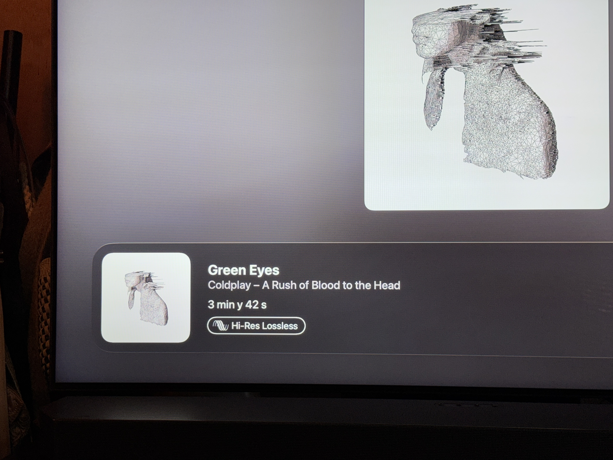
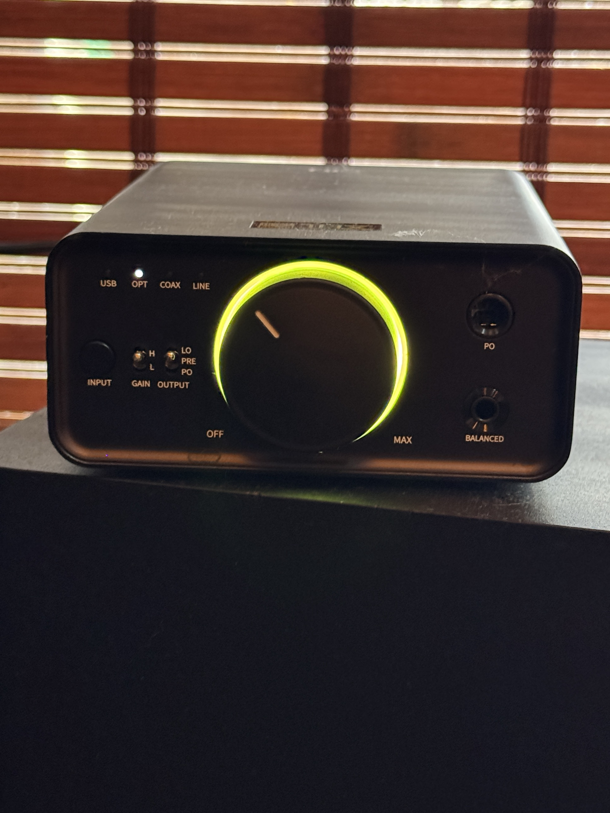
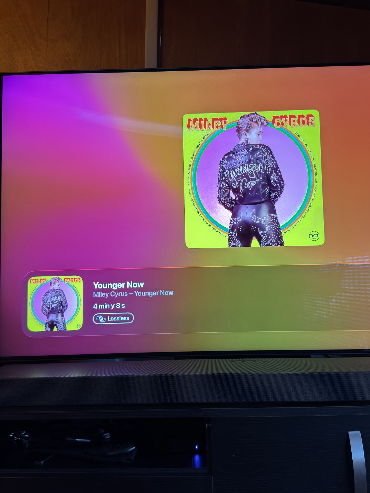
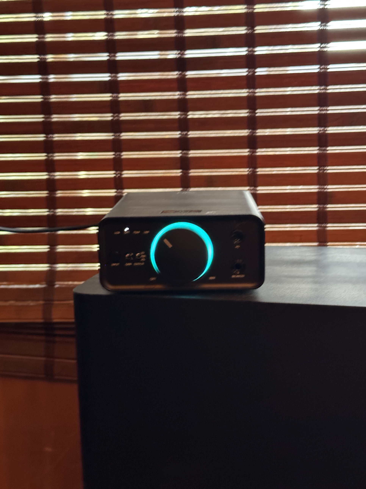
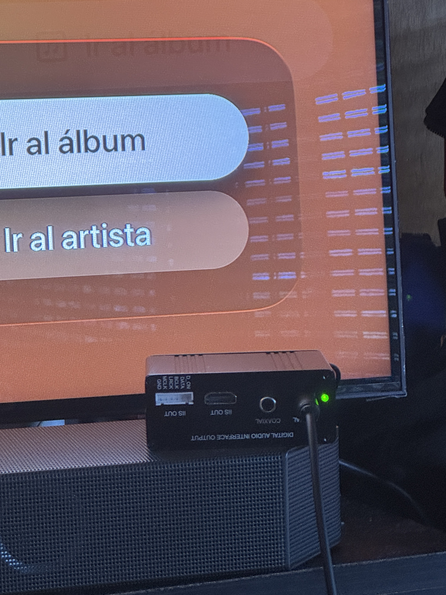
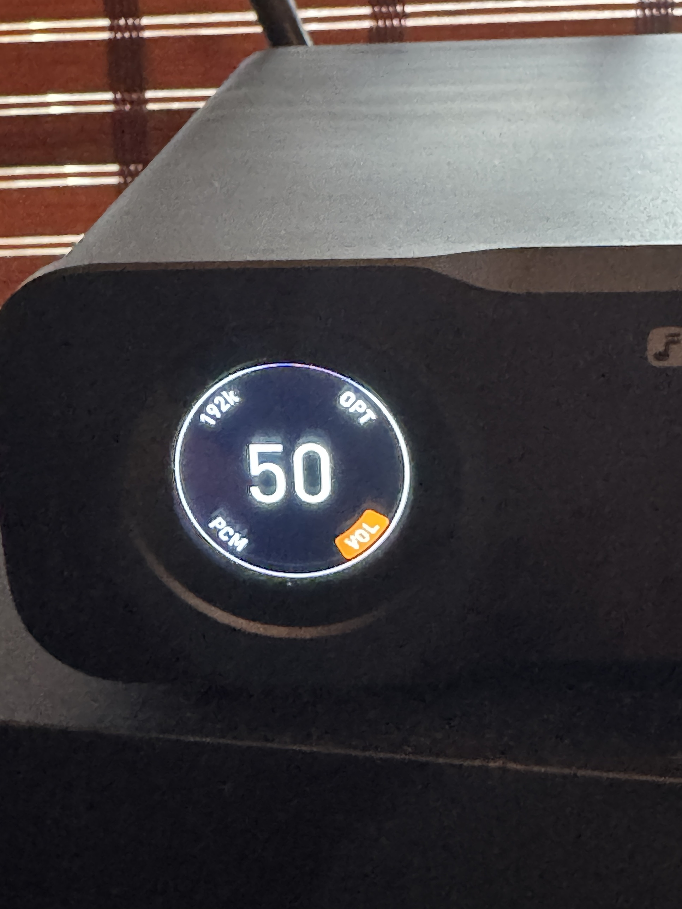
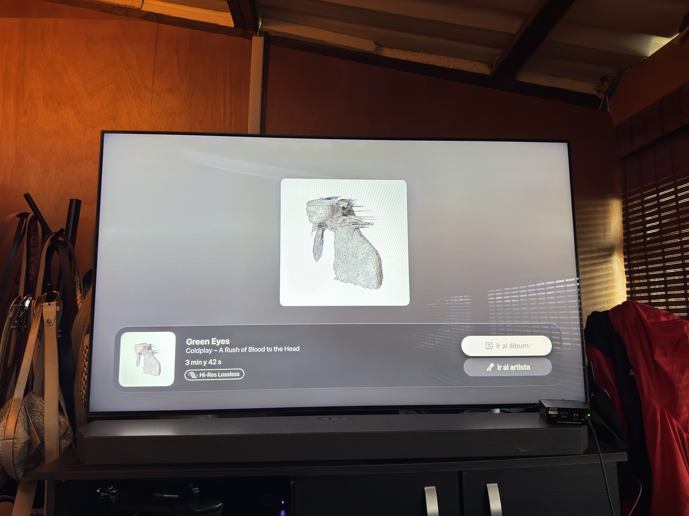

# Verificación de Hi-Res Lossless: Apple TV + Extractor de Audio HDMI + Varios DACs

> 🌐 **Español** · [English](README.en.md) · [中文](README.zh.md) · [हिन्दी](README.hi.md) · [日本語](README.ja.md) · [Português](README.pt.md)

Documentación de pruebas prácticas que confirman que Apple TV (con tvOS 27) entrega audio genuinamente por encima de 48kHz para contenido marcado como "Hi-Res Lossless" en Apple Music, verificado con distintos DACs conectados a la misma cadena de extracción de audio HDMI.

## Configuración común

- **Fuente**: Apple TV 4K, tvOS 27, app Apple Music
- **Conexión**: HDMI (Apple TV) → Extractor de audio HDMI → Salida óptica/coaxial → Entrada del DAC bajo prueba

---

## DAC 1: FiiO K7

**Dispositivo de verificación**: FiiO K7 (DAC/amplificador), indicador LED RGB alrededor de la perilla de volumen

### Método de prueba

El FiiO K7 no tiene pantalla numérica. Indica el sample rate de la señal digital entrante mediante el color de su LED RGB, según su propia página de soporte oficial:

| Color del LED | Significado |
|---|---|
| Cian | Sample rate ≤ 48kHz |
| Amarillo | Sample rate > 48kHz |
| Verde | Señal DSD |

### Resultado observado

- Reproduciendo una pista marcada **"Hi-Res Lossless"** en Apple Music (Coldplay — "Green Eyes") → LED se pone **amarillo** (> 48kHz)
- Reproduciendo una pista marcada **"Lossless"** estándar (Miley Cyrus — "Younger Now") → LED se pone **cian/azul** (≤ 48kHz)

### Evidencia fotográfica — FiiO K7

**Pista Hi-Res Lossless (Coldplay — "Green Eyes", *A Rush of Blood to the Head*)**

El badge "Hi-Res Lossless" es visible en la esquina inferior izquierda de la pantalla del Apple Music en Apple TV.

El LED del K7 se pone **amarillo/verde** — confirma sample rate > 48kHz, tal como predice la tabla oficial de FiiO.

**Pista Lossless estándar (Miley Cyrus — "Younger Now")**

Aquí el badge dice solo "Lossless" (sin "Hi-Res").

El LED del K7 cambia a **cian/azul** — confirma sample rate ≤ 48kHz, consistente con la clasificación estándar (no Hi-Res) de esta pista.

**El extractor de audio HDMI en la cadena**

Vista cercana del panel de salidas del extractor (óptica, coaxial, IIS/I2S) conectado entre el Apple TV y el DAC, con el LED de estado en verde indicando señal activa.

**Video**: cambio de color del LED en tiempo real.

https://github.com/user-attachments/assets/fa6dc061-688a-4db3-85d3-997c63ec1e9c

[Calidad original (.mov)](https://github.com/poch312/Oscar/releases/download/videos-hires/k7-led-cambio-color-video.mov)

---

## DAC 2: Fosi Audio ZD3

**Dispositivo de verificación**: Fosi Audio ZD3, pantalla OLED redonda — a diferencia del K7, muestra el **valor numérico exacto** del sample rate, no solo un color aproximado.

### Resultado observado

Reproduciendo **"Green Eyes"** (Coldplay — *A Rush of Blood to the Head*), marcada como **Hi-Res Lossless** en Apple Music, entrando por **óptico (OPT)**:

- La pantalla del ZD3 muestra: **192k** (sample rate), **PCM** (formato), volumen en **50**
- Esto confirma de forma numérica exacta — no aproximada por color — que la señal llega a 24-bit/192kHz, muy por encima del techo de 48kHz que existía antes de tvOS 27

Esto es una confirmación **más precisa** que la del K7: mientras el K7 solo indica "por encima de 48kHz" mediante el color amarillo, el ZD3 confirma el valor exacto (192kHz).

### Evidencia fotográfica — Fosi ZD3

Pantalla del ZD3 mostrando **192k / OPT / PCM** con el volumen en 50, mientras reproduce la pista Hi-Res Lossless.

Apple TV reproduciendo "Green Eyes" de Coldplay (álbum *A Rush of Blood to the Head*), con el badge "Hi-Res Lossless" visible, y el extractor de audio HDMI visible en la esquina inferior derecha sobre la barra de sonido.

**Videos**:

*Video 1*

https://github.com/user-attachments/assets/82a875ff-21fc-429f-bb8d-3ef2c630162e

[Calidad original (.mov)](https://github.com/poch312/Oscar/releases/download/videos-hires/zd3-video-1.mov)

*Video 2*

https://github.com/user-attachments/assets/a61e8090-e8d0-4bf9-a687-05de88ff00e6

[Calidad original (.mov)](https://github.com/poch312/Oscar/releases/download/videos-hires/zd3-video-2.mov)

*Video 3*

https://github.com/user-attachments/assets/0e932fb8-033e-4ee8-ab29-6125ce7eeeb3

[Calidad original (.mov)](https://github.com/poch312/Oscar/releases/download/videos-hires/zd3-video-3.mov)

---

## Explicación técnica (aplica a ambos DACs)

Hasta **tvOS 26**, Apple TV 4K limitaba **toda** la salida de audio por HDMI a un techo fijo de 24-bit/48kHz, sin importar el nivel de calidad seleccionado dentro de la app — es decir, aunque eligieras "Hi-Res Lossless", la salida real nunca superaba 48kHz.

Esto cambió con **tvOS 27** (lanzado en junio de 2026), que por primera vez permite que Apple TV 4K (modelos 2021 y 2022) entregue Hi-Res Lossless real hasta 24-bit/192kHz por HDMI, siempre que el sistema de audio conectado sea reconocido como compatible.

## Conclusión

El comportamiento observado en ambas pruebas confirma:

1. El Apple TV está corriendo tvOS 27 (o posterior)
2. Está entregando audio genuinamente por encima de 48kHz para contenido Hi-Res Lossless — no es solo una etiqueta de la interfaz sin cambio real en la señal
3. La cadena extractor de audio HDMI → DAC es reconocida por el sistema como una salida compatible con Hi-Res, habilitando la salida de mayor resolución
4. Con el ZD3 se confirma además el valor exacto: **192kHz**, no solo "por encima de 48kHz"

## Fuentes consultadas

- Página de soporte oficial de FiiO — tabla de indicación por color del LED del K7
- Ficha técnica oficial de Fosi Audio — especificaciones de pantalla y sample rate del ZD3
- Cobertura de prensa sobre tvOS 27 y los límites de audio previos de Apple TV (iPhoneSoft.fr, iFun.de)

---

*Documentado el 22 de septiembre de 2026.*
